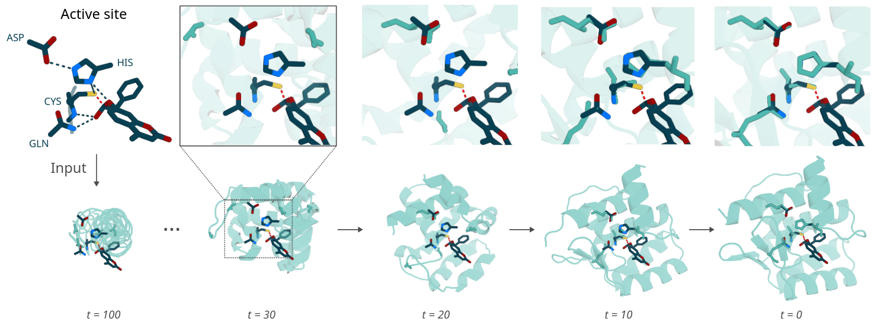
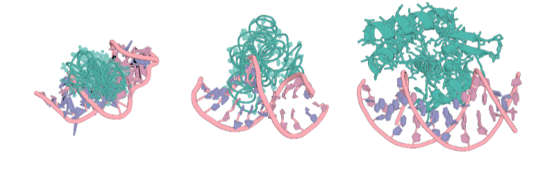
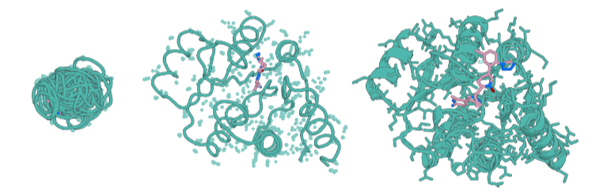
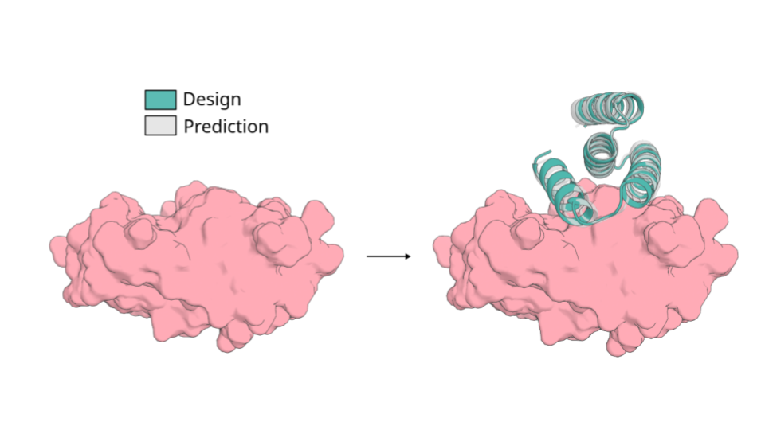
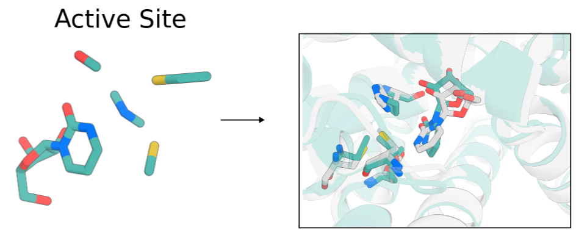

# De novo Design of Biomolecular Interactions with RFdiffusion3

<p align="center">
  
</p>

## Get Started
1. Install RFdiffusion3. See [Main README](../../README.md) for instructions how to install all models to run full pipeline (recommended). If you have already installed all the models skip [here](#run-inference). 
```bash
pip install rc-foundry[rfd3]
```
2. Download checkpoint to your desired checkpoint location.
```bash
foundry install rfd3 --checkpoint-dir /path/to/ckpt/dir
```

## Run Inference
```bash 
cur_ckpt=rfd3_foundry_2025_12_01.ckpt
```

To run inference
```bash
rfd3 design out_dir=logs/inference_outs/demo/0 inputs=models/rfd3/docs/demo.json ckpt_path=$cur_ckpt
```

> [!NOTE]
> This demo will take a very long amount of time if run on a
> CPU instead of a GPU. On a GPU, this should take on the
> order of 10 minutes.

Additional args here are added for verbosity, aligning trajectory structures, printing the config and dumping trajectories are turned off by default.

The output directory will automatically be created.

For full details on how to specify inputs, see the [input specification documentation](./docs/input.md). You can also see `models/rfd3/configs/inference_engine/rfdiffusion3.yaml`.

## Further example jsons for different applications

<table>
  <tr>
    <td align="center">
      <h3><a href="./docs/na_binder_design.md">Nucleic acid binder design</a></h3>
      
    </td>
    <td align="center">
      <h3><a href="./docs/sm_binder_design.md">Small molecule binder design</a></h3>
      
    </td>
    <td align="center">
      <h3><a href="./docs/protein_binder_design.md">Protein binder design</a></h3>
      
    </td>
  </tr>
  <tr>
    <td align="center">
      <h3><a href="./docs/enzyme_design.md">Enzyme design</a></h3>
      
    </td>
    <td align="center">
      <h3><a href="./docs/symmetry.md">Symmetric design</a></h3>
      
    </td>
  </tr>
</table>

##  Installation and Setup for Development and Training
### A. Installation using `uv`
```bash
git clone https://github.com/RosettaCommons/foundry.git \
  && cd foundry \
  && uv python install 3.12 \
  && uv venv --python 3.12 \
  && source .venv/bin/activate \
  && uv pip install -e ".[rfd3]"
```
<!--
> [!IMPORTANT]
> You must install `foundry` (the root package) with `-e` first, then install `rfd3`. This ensures both packages are in editable mode for proper development workflow.
-->
> [!NOTE]
> optionally make installed venv available as ipynb kernel (helpful for running examples in `examples/all.ipynb`)
`python -m ipykernel install --user --name=foundry --display-name "foundry"`
Download checkpoints.
```bash
foundry install rfd3 --checkpoint-dir /path/to/checkpoint/
```

## Inference:
```bash 
cur_ckpt=rfd3_foundry_2025_12_01.ckpt
```

To run inference
```bash
rfd3 design out_dir=logs/inference_outs/demo/0 inputs=models/rfd3/docs/demo.json ckpt_path=$cur_ckpt dump_trajectories=True
```

> [!NOTE]
> This demo will take a very long amount of time if run on a
> CPU instead of a GPU. On a GPU, this should take on the
> order of 10 minutes.

The output directory will automatically be created.

For full details on how to specify inputs, see the [input specification documentation](./docs/input.md). You can also see `models/rfd3/configs/inference_engine/rfdiffusion3.yaml`.

## Training (w & w/o WandB): #TODO make sure correct

To launch a training run, use:
```
uv run python models/rfd3/src/rfd3/train.py experiment=pretrain
```
See the paths [configs](/models/rfd3/configs/paths/) to customize the paths where data is read from and where logs are written. There is also a wandb config that can be enabled if you want to log training through wandb. 

### Install HBPLUS for training with hydrogen bond conditioning:


1. Download hbplus from here: https://www.ebi.ac.uk/thornton-srv/software/HBPLUS/download.html (available for free)
2. Follow the installation instruction here: https://www.ebi.ac.uk/thornton-srv/software/HBPLUS/install.html
3. Update `HBPLUS_PATH` in `foundry/.env` file with the path to your `hbplus` executable.


## Citation

If you use this code or data in your work, please cite:

```bibtex
@article {butcher2025_rfdiffusion3,
	author = {Butcher, Jasper and Krishna, Rohith and Mitra, Raktim and Brent, Rafael Isaac and Li, Yanjing and Corley, Nathaniel and Kim, Paul T and Funk, Jonathan and Mathis, Simon Valentin and Salike, Saman and Muraishi, Aiko and Eisenach, Helen and Thompson, Tuscan Rock and Chen, Jie and Politanska, Yuliya and Sehgal, Enisha and Coventry, Brian and Zhang, Odin and Qiang, Bo and Didi, Kieran and Kazman, Maxwell and DiMaio, Frank and Baker, David},
	title = {De novo Design of All-atom Biomolecular Interactions with RFdiffusion3},
	elocation-id = {2025.09.18.676967},
	year = {2025},
	doi = {10.1101/2025.09.18.676967},
	publisher = {Cold Spring Harbor Laboratory},
	URL = {https://www.biorxiv.org/content/early/2025/11/19/2025.09.18.676967},
	eprint = {https://www.biorxiv.org/content/early/2025/11/19/2025.09.18.676967.full.pdf},
	journal = {bioRxiv}
}
```
