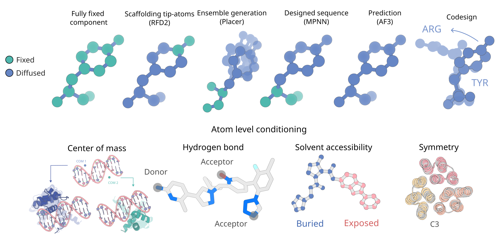
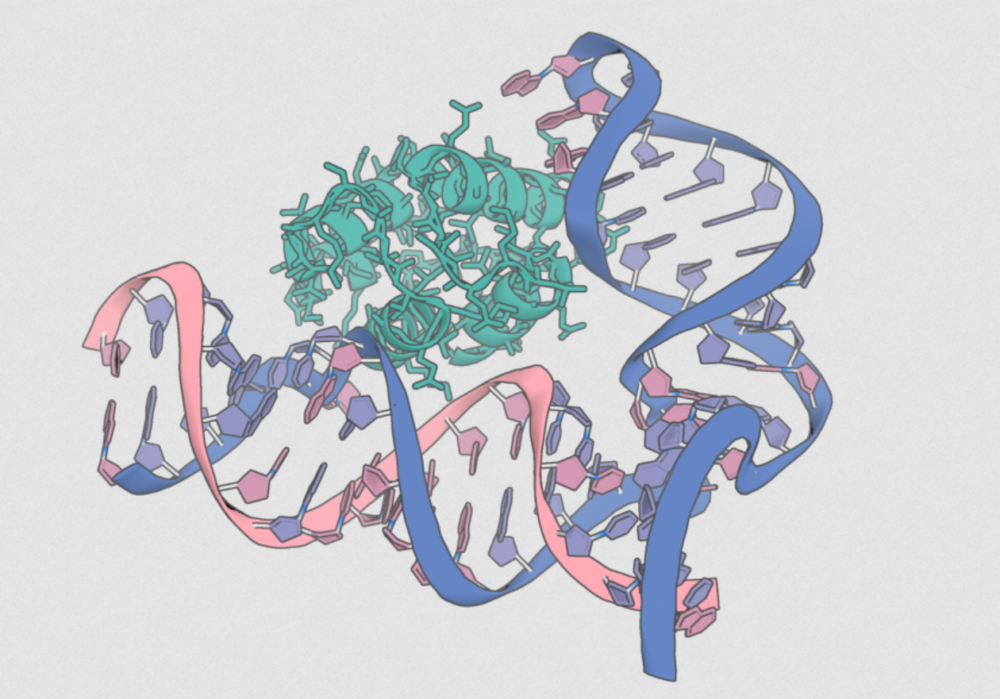
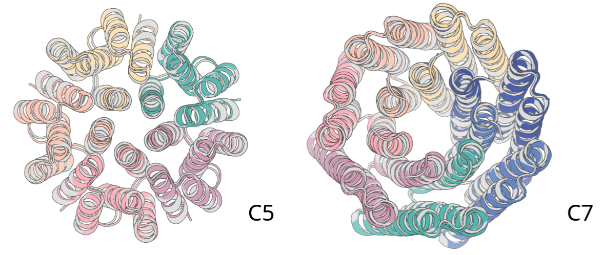

# De novo Design of Biopolymers with Atomic Functional Sites using RFdiffusion3

RFdiffusion3NA (RFD3NA) is an expanded version of RFDiffusion3, that can design multiplolymer structures (including protein-DNA-RNA) under complex constraints.

This repository contains both the training and inference code, and
both are described in more detail below.


<p align="center">
  
</p>

## Getting Started
1. Install RFdiffusion3NA. 
  If you have already installed all the models and **are not** interested in hydrogen bond conditioning skip [here](#running-inference). <br><br>
  If you have already installed all the models and **are** interested in hydrogen bond conditioning skip [here](#hydrogen-bond-conditioning)
  If you would like to install all of the foundry models (recommended), see the [foundry README](../../README.md) for instructions. <br><br>
  If you would like to install only RFD3NA: 
    ```bash
    pip install rc-foundry[rfd3na]
    ```

2. Download checkpoint to your desired checkpoint location.
    ```bash
    foundry install rfd3na --checkpoint-dir <path/to/ckpt/dir>
    ```
    This sets `FOUNDRY_CHECKPOINT_DIRS` and will in future look for checkpoints in that directory (alongside the default `~/.foundry/checkpoints` location), allowing you to run inference without supplying the checkpoint path. The checkpoint directory is optional, defaulting to `~/.foundry/checkpoints` if unset.

Recommended checkpoint (default): https://files.ipd.uw.edu/pub/rfdiffusion3na/rfd3na-1190.ckpt

Preprint Figure 2 checkpoint: https://files.ipd.uw.edu/pub/rfdiffusion3na/rfd3na-890.ckpt

### Hydrogen Bond Conditioning
If you would like to use hydrogen bond conditioning in your designs, 
you need to install [HBPLUS](https://www.ebi.ac.uk/thornton-srv/software/HBPLUS/). This is **not** installed by default:

3. Download HBPLUS from here: https://www.ebi.ac.uk/thornton-srv/software/HBPLUS/download.html (available for free)
4. Follow the installation instruction here: https://www.ebi.ac.uk/thornton-srv/software/HBPLUS/install.html
5. Update `HBPLUS_PATH` in `foundry/.env` file with the path to your `hbplus` executable.

## Running Inference

Below is a quick inference example to run to test that your setup
is working correctly. 

To run inference (with foundry installed in your environment, or RFD3 & Foundry src in PYTHONPATH):
```bash
rfd3na design out_dir=logs/inference_outs/demo/0 inputs=models/rfd3na/docs/examples/atom23_design.json skip_existing=False dump_trajectories=True prevalidate_inputs=True read_sequence_from_sequence_head=False
```

`read_sequence_from_sequence_head=False` is recommended global setting for RFD3NA.

Similar concepts of input specification as in RFD3 apply here:

Main modification is you can now specify 'R' or 'D' suffix to your contig parts to specify RNA or DNA generation e.g. `10-10,20-20R,30-30D` would generate a protein chain of length 10, an RNA chain of length 20 and a DNA chain of length 30.

See the RFD3 [external documentation for more details](https://rosettacommons.github.io/foundry/models/rfd3/index.html#general)) where you specify your design constraints and the output directory (`out_dir`) where you want to store the files RFD3NA generates.

Additional unnecessary (but useful!) options are added to the above command:
- `dump_trajectories`: Dumps trajectory structures, can be useful for debugging your setup or making cool gifs. However, trajectory files are large, thus this setting is False by default.
- `prevalidate_inputs`: Checks that your inputs are valid before running inference. Helpful if your JSON/YAML has a number of different configs you want to debug / double check are valid before loading the checkpoints.
- `skip_existing`: Skips any existing files that would be in the same place and have the same name as the calculation being run. If you are testing your setup multiple times, including this option is important so that you actually run RFdiffusion3. 

There are various interesting ways you can use RFD3NA design as it's trained on a large array of different tasks for botjh protein and nucleic acids.
For example, you can fix sequence and not structure (prediction-type task), fix the backbone and unfix the sequence (MPNN-type inverse folding) or unfix the sidechains only (PLACER/ChemNet-style):

<p align="center">
  
</p>

For full details on how to specify inputs, see the [input specification documentation](./docs/input.md). You can also see `foundry/models/rfd3/configs/inference_engine/rfdiffusion3.yaml` for even more options.
The `BKBN` and `TIP` shorthands do not apply to nucleic acids, but the functionalities exist. Should specify corresponding atom names.


## Further example JSONs for different applications
Additional examples are broken up by use case. If you have cloned the
repository, matching `.json` files are in `foundry/models/rfd3/docs/examples`
that can be run directly, similar to the previous example. 

In the examples, the paths to the input files are specified assuming
that you are running the examples from the `foundry/models/rfd3/docs/examples`
directory. If you would like to run RFD3 from a different location, 
you will need to change the path in the `.json` file(s) before running.

<table>
  <tr>
    <td align="center">
      <h3><a href="./docs/examples/atom23_design.md">Multipolymer design</a></h3>
      
    </td>
     <td align="center">
      <h3><a href="./docs/examples/na_binder_design.md">Nucleic acid binder design</a></h3>
      
    </td>
    <td align="center">
      <h3><a href="./docs/examples/protein_binder_design.md">Protein binder design</a></h3>
      
    </td>

  </tr>
  <tr>
    <td align="center">
      <h3><a href="./docs/examples/enzyme_design.md">Enzyme design</a></h3>
      
    </td>
    <td align="center">
      <h3><a href="./docs/examples/symmetry.md">Symmetric design</a></h3>
      
    </td>
    <td align="center">
      <h3><a href="./docs/examples/sm_binder_design.md">Small molecule binder design</a></h3>
      
    </td>

  </tr>
</table>

## Training and Fine-Tuning

We make available to the community not only the weights to run RFdiffusion3NA but also the complete training code, easily extendable to additional use cases. Any AtomWorks-compatible dataset (and thus, any collection of structure files) can be readily incorporated and used for training or fine-tuning.

### Dataset Configuration

#### PDB Training

To train on the PDB:

1. Set up PDB and CCD mirrors as described in the [AtomWorks documentation](https://rosettacommons.github.io/atomworks/latest/mirrors.html)
2. Update the [path configs](/models/rfd3na/configs/paths/) to point to the correct base directories for the metadata parquets
3. Set the `PDB_MIRROR` and `CCD_PATH` variables in your `.env` file

#### Custom Datasets

RFdiffusion3NA supports arbitrary datasets of structure files for training and fine-tuning via AtomWorks. See the [AtomWorks dataset documentation](https://rosettacommons.github.io/atomworks/latest/auto_examples/dataset_exploration.html) for details on creating custom datasets.

### Running Training

After setting up Hydra configs, launch a training run:
```bash
uv run python models/rfd3na/src/rfd3na/train.py experiment=rfd3na ckpt_path=<path/to/ckpt>
```

Supplying `ckpt_path=null` (default) will start with fresh weights.
See the [path configs](/models/rfd3na/configs/paths/) to customize data input and log output directories.

### Logging Configuration

Training runs support logging via [Weights & Biases](https://wandb.ai/). To enable wandb logging:

```bash
uv run python models/rfd3na/src/rfd3na/train.py experiment=rfd3na logger=wandb
```

To run training without wandb (default):
```bash
uv run python models/rfd3na/src/rfd3na/train.py experiment=rfd3na logger=csv
``` 

### Install HBPLUS for training with hydrogen bond conditioning:

1. Download hbplus from here: https://www.ebi.ac.uk/thornton-srv/software/HBPLUS/download.html (available for free)
2. Follow the installation instruction here: https://www.ebi.ac.uk/thornton-srv/software/HBPLUS/install.html
3. Update `HBPLUS_PATH` in `foundry/.env` file with the path to your `hbplus` executable.

## Distributed Training
To use distributed training, you could use a command such as this (we use Lightning Fabric to handle ddp)
```
EFFECTIVE_BATCH_SIZE=16
DEVICES_PER_NODE= #INSERT NUMBER OF DEVICES PER NODE
NNODES = # INSERT NUMBER OF NODES
GRAD_ACCUM_STEPS=$((EFFECTIVE_BATCH_SIZE / (DEVICES_PER_NODE * NNODES)))
srun  --kill-on-bad-exit uv run python models/rfd3na/src/rfd3na/train.py \
    experiment=pretrain \
    trainer.devices_per_node=$DEVICES_PER_NODE \
    trainer.num_nodes=$SLURM_NNODES \
    trainer.grad_accum_steps=$GRAD_ACCUM_STEPS"
```
Notably, fabric must receive `devices_per_node` and the number of nodes (`num_nodes`) you're training on.

**Dataset Paths:** See the paths [configs](/models/rfd3na/configs/paths/) to customize the paths where data is read from and where logs are written. There is also a wandb config that can be enabled if you want to log training through wandb. 

**Hydra configs and experiments:** In the example above, the `experiment` argument is a hydra-native argument. For RFD3NA, it will look for config overrides in `/models/rfd3na/configs/experiment/<experiment-name>.yaml` and apply them on top of the base configs

**Conditioning during training:** RFD3NA is trained on a multitude of conditioning tasks, and does so by randomly 'creating problems' for it to solve during training. For example, for a random training example it gets a random set of tokens to be 'motif tokens', then subsets those to whether specific atoms should be fixed, and further subsets the information to whether, say, sequence, coordinates or the sequence index should be fixed. It's pretty complicated to evaluate and how it was put together was more of an art than a science. There's likely still room for 
further optimization!

In `models/rfd3na/configs/datasets/design_base_rfd3na.yaml` there's the shared configs for all datasets under `global_transform_args`. The dials that control the conditioning described above go under `training_conditions`, where for example `tipatom` - a specific preset conditioning sampler which more frequently fixes few tokens with few atoms - and others can be found.

**Training with WandB:** We strongly recommend tracking your runs via wandb. To use it, simply have your WANDB_API_KEY set and use the wandb logger. For more details see [here](https://wandb.ai/site/)

# Appendix

## Install HBPLUS for hydrogen bond conditioning:
One of the examples shows how to incorporate hydrogen bond conditioning 
into your designs. To make use of this feature, you will need to 
additionally complete the following steps:

1. Download hbplus from here: https://www.ebi.ac.uk/thornton-srv/software/HBPLUS/download.html (available for free)
2. Follow the installation instruction here: https://www.ebi.ac.uk/thornton-srv/software/HBPLUS/install.html
3. Update `HBPLUS_PATH` in `foundry/.env` file with the path to your `hbplus` executable.

## Citation

If you use this code or data in your work, please consider citing:

```bibtex
@article {butcher2025_rfdiffusion3,
	author = {Butcher, Jasper and Krishna, Rohith and Mitra, Raktim and Brent, Rafael Isaac and Li, Yanjing and Corley, Nathaniel and Kim, Paul T and Funk, Jonathan and Mathis, Simon Valentin and Salike, Saman and Muraishi, Aiko and Eisenach, Helen and Thompson, Tuscan Rock and Chen, Jie and Politanska, Yuliya and Sehgal, Enisha and Coventry, Brian and Zhang, Odin and Qiang, Bo and Didi, Kieran and Kazman, Maxwell and DiMaio, Frank and Baker, David},
	title = {De novo Design of All-atom Biomolecular Interactions with RFdiffusion3},
	elocation-id = {2025.09.18.676967},
	year = {2025},
	doi = {10.1101/2025.09.18.676967},
	publisher = {Cold Spring Harbor Laboratory},
	URL = {https://www.biorxiv.org/content/early/2025/11/19/2025.09.18.676967},
	eprint = {https://www.biorxiv.org/content/early/2025/11/19/2025.09.18.676967.full.pdf},
	journal = {bioRxiv}
}
```
